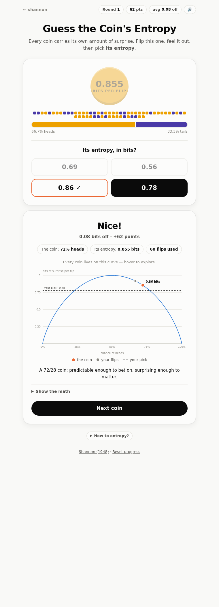

# shannon

**Claude Shannon's ideas, made playable.**

**▶ Play it live: <https://kaiwong-sapiens.github.io/shannon/>**

Small interactive games that turn the foundations of information theory into things
you can feel. Shannon's 1948 paper *A Mathematical Theory of Communication* invented
the bit, entropy, and channel capacity — this repo tries to give you the *intuition*
for those ideas, one game at a time.

## Play

No build step, no dependencies — plain HTML/CSS/JS.

```sh
python3 -m http.server            # then open http://localhost:8000
```

or just open `index.html` straight from disk. Everything works offline.

## Explorables

### 1 · Guess the Coin's Entropy — [`games/coin-entropy/`](games/coin-entropy/)



A coin is minted with a secret bias. Press it to spin, release to let it coast and
land — every flip is a real toss. Watch the tally drift, then pick **its entropy**
— the surprise per flip — from three candidate values: one is exact, the other two
are distractors (one close, one far), so you still have to genuinely discriminate.
Wrong picks get crossed off — flip a few more and try again until you find it.
No scores, no streaks; just the coin and your read of it. When you land the right
answer, everything else — where the coin sits on the binary entropy curve, what
your flips suggested, the worked formula, and the sampling-noise floor — waits
behind a "Show the details" fold for the curious.

Entropy is treated as a tangible property of the coin itself: heads and tails are
distinct faces engraved like a real coin (obverse: gold, Shannon's portrait;
reverse: violet, a star over 1948), the coin **fidgets in proportion to the
entropy your flips imply** (restlessness = unpredictability, computed from the
observed tally so it never leaks the answer), and at the reveal it turns over to
show its true worth stamped into the metal — bits per flip, like a denomination.

What it's designed to teach:

- A fair coin is worth exactly **1 bit** per flip; a certain outcome is worth **0**.
- The entropy curve is *flat near the top* — a 60/40 coin still carries 0.97 bits.
  Mild bias hides in plain sight.
- Sampling is noisy: with few flips, even a perfect reasoner can't pin entropy down.
  The reveal quantifies that noise floor, so you know when your miss was just luck.

The math, for the curious: entropy of a coin with heads-probability *p* is
`H(p) = −p·log₂p − (1−p)·log₂(1−p)` bits. Hidden coins are sampled *uniformly in
entropy* (not in bias) so low-, mid-, and high-entropy coins all show up equally
often. Scoring starts at 100 and drops 5 points per 0.01 bits of error.

## Roadmap

- **The Redundancy of English** — guess text letter-by-letter, recreating Shannon's
  1951 estimate of ~1 bit per letter.
- **The Noisy Channel** — send messages through static; discover parity and why
  structured redundancy beats repetition.
- **Build-a-Code** — assign short codewords to common symbols and race the entropy
  limit (source coding / Huffman).

## Structure & design

- Each explorable is self-contained under `games/<name>/` (HTML + CSS + JS, no
  shared runtime), linked from the landing page `index.html`.
- Light and dark mode via `prefers-color-scheme` (append `?dark` to force dark).
- Sound is synthesized with the Web Audio API — no audio files. Heads and tails
  land on different notes (E6 / A5), the reveal stamps with a thunk, and a short
  jingle rises or falls with your accuracy. Mutable via the 🔊 chip; persisted.
- Chart and category colors were validated for colorblind safety (CVD ΔE) and
  surface contrast in both modes; identity is never carried by color alone.
- Test hooks: `games/coin-entropy/index.html?demo` renders a deterministic reveal
  state, `?demoplay` a deterministic mid-game state — handy for screenshots and
  visual regression checks.

## Reading

- Claude Shannon, [*A Mathematical Theory of Communication*](https://people.math.harvard.edu/~ctm/home/text/others/shannon/entropy/entropy.pdf) (1948)
- Claude Shannon, *Prediction and Entropy of Printed English* (1951)
